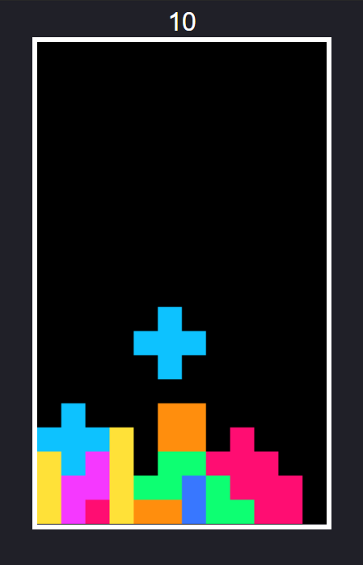

# Tetris

## Descrição

A simple game of tetris made in Javascript

## Como jogar 

### tecla 'w' rotaciona as peças
### teclas (←),(→) e (↓) movem as peças para suas respectivas direções    

## Autor
* [Nikumu](https://www.github.com/nikumu)

## License
[MIT](LICENSE)
